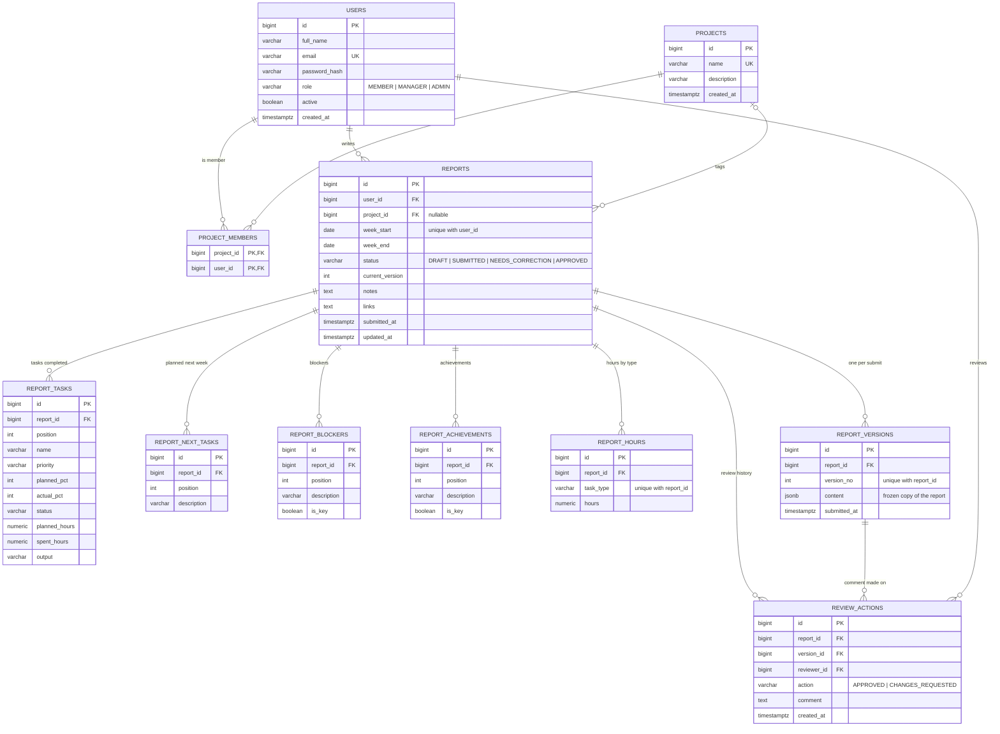

# ER Diagram

## How to read it

- **Roles** are a column on `users` (one role per user, as the app needs).
- **`reports`** holds the current, editable report: one per user per week (`unique(user_id, week_start)`).
- The report's lists live in child tables (`report_tasks`, `report_blockers`, ...), so the structure is fixed and the dashboard can query it.
- **Version history:** every submit writes a JSON snapshot to `report_versions`. Editing after "Needs Correction" never overwrites an old version.
- **Review history:** every Approve / Request Changes decision is a row in `review_actions`, linked to the exact `version_id` it was made against.
- Current status and version number sit on `reports`; the latest comment is the newest `review_actions` row.
